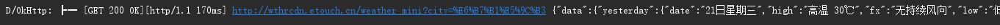
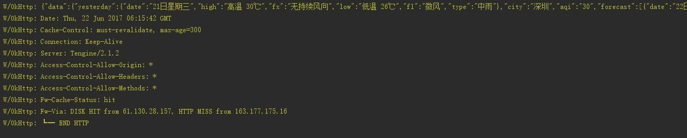
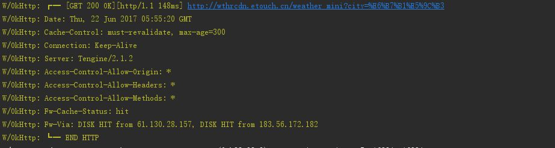
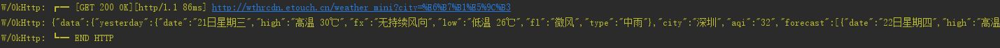

# OKHttpLoggingInterceptor
	A Pretty OkHttp Logging Interceptor：一款简洁漂亮的OkHttp Logging拦截器，可以设置多个log打印等级，随你心意，输出你想要的
	log。最好在OkHttp3.0以及更新版本使用，防止某些类找不到的问题

## 编译：
	compile 'com.ayvytr:OKHttpLoggingInterceptor:1.0.0'

## 使用：

	1.添加OkHttp依赖
	2.设置拦截器

			LoggingInterceptor interceptor = new LoggingInterceptor(LoggingLevel.STATE);
	        OkHttpClient okHttpClient = new OkHttpClient.Builder().addInterceptor(interceptor)
	                                                              .connectTimeout(10, TimeUnit.SECONDS)
	                                                              .readTimeout(10, TimeUnit.SECONDS)
	                                                              .writeTimeout(10, TimeUnit.SECONDS)
	                                                  			  .build();

	3. 而后，使用OkHttp进行Http连接，即可在Logcat中看到打印的日志。通过关键字"OkHttp"即可筛选拦截器log

## 详细用法

### 设置警告

#### 默认类型log，级别为Debug
	
	LoggingInterceptor interceptor = new LoggingInterceptor();

#### 警告级别log
	LoggingInterceptor interceptor = new LoggingInterceptor(LoggingLevel.ALL, LoggingInterceptor.Logger.WARN);

### 设置log打印类型

#### NONE:不打印log

	LoggingInterceptor interceptor = new LoggingInterceptor(LoggingLevel.NONE);

#### URL_BODY: 打印url和响应体

	LoggingInterceptor interceptor = new LoggingInterceptor(LoggingLevel.URL_BODY);

#### SINGLE: 打印Http状态，url, 请求时长和响应体.

	LoggingInterceptor interceptor = new LoggingInterceptor(LoggingLevel.SINGLE);

#### STATE: 打印Http状态和url

	LoggingInterceptor interceptor = new LoggingInterceptor(LoggingLevel.STATE);

#### HEADERS: 打印Http状态，url，请求头和响应头

	LoggingInterceptor interceptor = new LoggingInterceptor(LoggingLevel.HEADERS);

#### BODY: 打印Http状态，url, 请求时长和响应体.

	LoggingInterceptor interceptor = new LoggingInterceptor(LoggingLevel.BODY);

#### ALL: 打印http状态，url，请求时长，响应体，请求头和响应头

	LoggingInterceptor interceptor = new LoggingInterceptor(LoggingLevel.ALL);

## 用法到此结束，接下来到了最欢乐的推荐环节了：

1. [EasyAndroid:简化Android开发的精品库](https://github.com/Ayvytr/EasyAndroid)
2. [PrettyItemDecorations:RecyclerView分割线，以及微信联系人右侧字母索引效果](https://github.com/Ayvytr/PrettyItemDecorations)
3. [Logger:极简漂亮的日志打印库，直接这样用：L.e(msg)，不用再设置tag啦！](https://github.com/Ayvytr/Logger)

## [别忘了给我点个Star](https://github.com/Ayvytr/OKHttpLoggingInterceptor)
