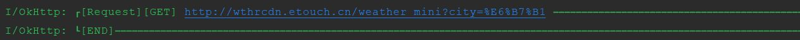

OKHttpLogInterceptor [](https://bintray.com/ayvytr/maven/okhttploginterceptor/_latestVersion)

network：网络封装库，2.1.0起基于OKhttp 4.4和Retrofit 2.8.1。 [](https://bintray.com/ayvytr/maven/network/_latestVersion)

[](license)

# OKHttpLogInterceptor
	一款好用漂亮的OkHttp Logging拦截器。3.0.0进行了大改版，取消以前繁杂的多种打印模式，最大化精简配置，并支持了json，xml的格式化打印，提高了可读性


## 依赖：

    //okhttploginterceptor
    implementation 'com.ayvytr:okhttploginterceptor:3.0.1'
    
    //历史版本，推荐使用3.0.0+
    implementation 'com.ayvytr:okhttploginterceptor:2.2.2'


​    
​    //network:OkHttp和Retrofit包装库
​    implementation 'com.ayvytr:network:2.2.0'


​    


## 截图

### isShowAll=false：显示除请求头，请求参数，响应头外的所有内容





### isShowAll=true：显示所有内容，Get请求会显示url后边附带的Query参数


## 使用配置：

### okhttploginterceptor

	//全部都为可选参数，
	//showLog：是否显示日志
	//isShowAll：true：显示所有日志；false：显示除请求头，get请求query参数，响应头外的所有参数
	//priority: Log优先级
	val loggingInterceptor = LoggingInterceptor(showLog = true,
	                              isShowAll = false,
	                              priority = Priority.E,
	                              tag = "自定义tag") {
	        //Log的自定义处理，比如输出到其他地方
	    }
	    
	var client: OkHttpClient = OkHttpClient.Builder().addInterceptor(loggingInterceptor)
	    .connectTimeout(10, TimeUnit.SECONDS)
	    .readTimeout(10, TimeUnit.SECONDS)
	    .writeTimeout(10, TimeUnit.SECONDS)
	    .build()

### network

```
//初始化，默认开启了OKhttp缓存，cache=null关闭
ApiClient.getInstance().init("https://gank.io/api/", cache = null)
//覆盖重写自定义全局网络异常转为ResponseMessage
ApiClient.throwable2ResponseMessage = {
ResponseMessage("自定义错误", throwable = it)
}

//获取api，第二个参数传入不同的base url，获得使用另一个base url的Api接口
private val api = ApiClient.getInstance().create(Api::class.java, other_url)

```


## ChangeLog

### okhttploginterceptor

* 3.0.1 尝试解决log打印行数特别多时却行的问题

* 3.0.0 全新改版，取消以前的多种打印模式，最大化精简了配置，并支持了json，xml的格式化打印，提高了可读性

* ~~4.4.0 适配OkHttp 4.4的前后衔接失败的版本，已经删除~~

* 2.1.0 历史版本


### network

* 2.2.2  增加[CookieJar](https://github.com/franmontiel/PersistentCookieJar)支持

* 2.2.1  更新依赖okhttploginterceptor版本到3.0.1

* 2.2.0  更新依赖okhttploginterceptor版本到3.0.0

* 2.1.1  增加APIClient.throwable2ResponseMessage，作为全局的Throwable转ResponseMessage的网络异常转换函数
* 2.1.0  支持OkHttp 4.x，后续直接以OkHttp 4.x为基础进行更新


