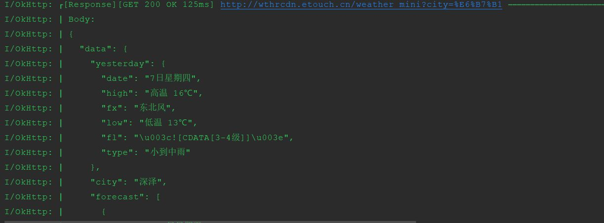

# Readme

OKHttpLogInterceptor [](https://maven-badges.herokuapp.com/maven-central/io.github.ayvytr/okhttploginterceptor)

network [](https://maven-badges.herokuapp.com/maven-central/io.github.ayvytr/network)

network-cache-cookie[](https://search.maven.org/search?q=g:%22io.github.ayvytr%22%20AND%20a:%22network-cache-cookie%22)

[](license)

# OKHttpLogInterceptor
	一款好用漂亮的OkHttp Logging拦截器。3.0.0进行了大改版，取消以前繁杂的多种打印模式，最大化精简配置，并支持了json，xml的格式化打印，提高了可读性


## 依赖：

### okhttploginterceptor

    //3.0.6+:
    mavenCentral()
    implementation 'io.github.ayvytr:okhttploginterceptor:3.0.8'
    
    //3.0.6之前的版本：
    implementation 'com.ayvytr:okhttploginterceptor:3.0.5'


### network:OkHttp和Retrofit包装库

```
mavenCentral()

implementation 'io.github.ayvytr:network:3.0.2'
//cache和cookie相关类，引入后需要自行配置到OkHttp
implementation 'io.github.ayvytr:network-cache-cookie:3.0.2'
```


## 预览

### isShowAll=false：显示除请求头，请求参数，响应头外的所有内容





### isShowAll=true：显示所有内容，Get请求会显示url后边附带的Query参数


## 参数

| 字段/方法            | 作用                                                         |
| -------------------- | ------------------------------------------------------------ |
| ignoreLongBody       | 是否忽略过长的response body, 默认true；默认超过16MB，不打印response body. |
| ignoreBodyIfMoreThan | 超过ignoreBodyIfMoreThan字节就忽略response body不打印，注意：这里单位是字节，默认字节数为16MB. |


## ChangeLog

### okhttploginterceptor

* 3.0.9
  * 修改response.peekBody长度太长导致异常的问题
  * 修改response.contentType()为空时未打印响应体的问题，尝试判断是否为json字符串并打印

* 3.0.8
  * 排除aar中的BuildConfig.class

* 3.0.6
  * 上传文件Log更友好：判断request，如果是[MultipartBody]，认为是文件，只打印基本信息，不打印body
  * 修改ignoreBodyIfMoreThan默认长度为100KB

* 3.0.5
  * 限制response body打印，只有contentType包含：text/xml/json/html/plain（认为可解析），并且没超出规定的最大长度（默认16MB），才会打印response body，以解决例如下载文件body过大导致OOM的问题
* 3.0.4
  * 优化解决了request和response log串行问题
* 3.0.3  
  * 增加[requestTag],[responseTag]，区分请求和响应的tag，默认请求tag为："OkHttp-Request"，默认响应tag为："OkHttp-Response"
  * 修改打印逻辑为异步打印，解决请求半秒钟，打印5秒钟的问题（主要由于json格式化行数过多，同步打印过于消耗时间）
* 3.0.2 
  * 取消moreAction，修改为[IPrinter]作为自定义log接口
  * 重写[separateByLength], [visualFormat]=false时，限制每行最大长度的同时，不定长每行长度，以separateChars中 ',', ' '等字符作为每行最后一个字符，以减少有效字符串被截成两行的问题
* 3.0.1 尝试解决log打印行数特别多时却行的问题
* 3.0.0 全新改版，取消以前的多种打印模式，最大化精简了配置，并支持了json，xml的格式化打印，提高了可读性
* ~~4.4.0 适配OkHttp 4.4的前后衔接失败的版本，已经删除~~
* 2.1.0 历史版本


### network

* 3.0.2
  * 排除aar中的BuildConfig.class
  * 修改ApiClient.logInterceptor 不打印请求信息的问题（release包BuildConfig.Debug=false）

* 3.0.1
  * 修改ApiClient.init()中**interceptors**不是默认值时LoggingInterceptor丢失问题
  * 修改LoggingInterceptor默认Debug显示所有log，包括请求头信息
  * ApiClient.init()增加**@JvmStatic**

* 3.0.0 改版拆分，cache和cookie拆分到扩展模块**network-cache-cookie**

* 2.3.5 更新依赖okhttploginterceptor为3.0.6
* 2.3.3  更新依赖okhttploginterceptor为3.0.3
* 2.3.2  取消ResponseException.messageStringId可空
* 2.3.1  删除BaseResponse，ResponseWrapper取消继承BaseResponse
* 2.3.0  增加CookieJar支持。[参考PersistentCookieJar](https://github.com/franmontiel/PersistentCookieJar)
* 2.2.1  更新依赖okhttploginterceptor版本到3.0.1
* 2.2.0  更新依赖okhttploginterceptor版本到3.0.0
* 2.1.1  增加APIClient.throwable2ResponseMessage，作为全局的Throwable转ResponseMessage的网络异常转换函数
* 2.1.0  支持OkHttp 4.x，后续直接以OkHttp 4.x为基础进行更新

### network-cache-cookie

* 3.0.0 第一版拆分
* 3.0.2 排除aar中的BuildConfig


## 使用配置：

### okhttploginterceptor

	//全部都为可选参数，
	//showLog：是否显示日志
	//isShowAll：true：显示所有日志；false：显示除请求头，get请求query参数，响应头外的所有参数
	//priority: Log优先级
	val loggingInterceptor = LoggingInterceptor(showLog = true,
	                              isShowAll = false,
	                              priority = Priority.E,
	                              tag = "自定义tag", object: IPrinter {
	            override fun print(priority: Priority, tag: String, msg: String) {
	                //Log的自定义处理，比如输出到其他地方
	            }
	        })
	    
	var client: OkHttpClient = OkHttpClient.Builder().addInterceptor(loggingInterceptor)
	    .connectTimeout(10, TimeUnit.SECONDS)
	    .readTimeout(10, TimeUnit.SECONDS)
	    .writeTimeout(10, TimeUnit.SECONDS)
	    .build()

### network

```
//获取api，第二个参数传入不同的base url，获得使用另一个base url的Api接口
val api = ApiClient.get(Api::class.java, other_url)

```


